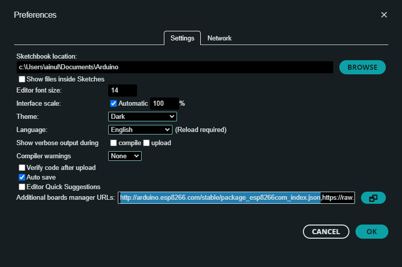
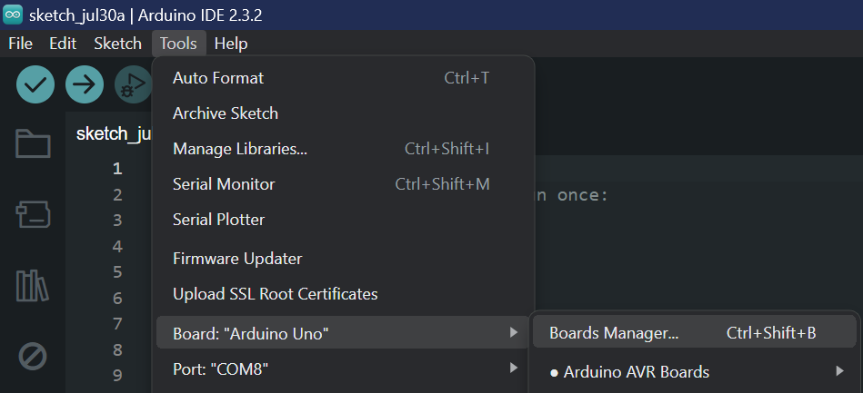
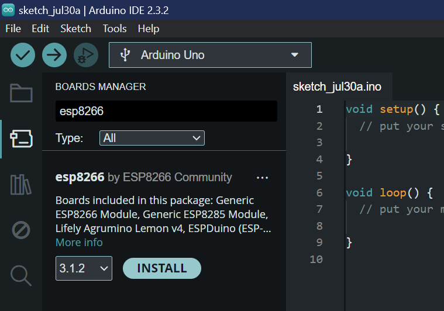
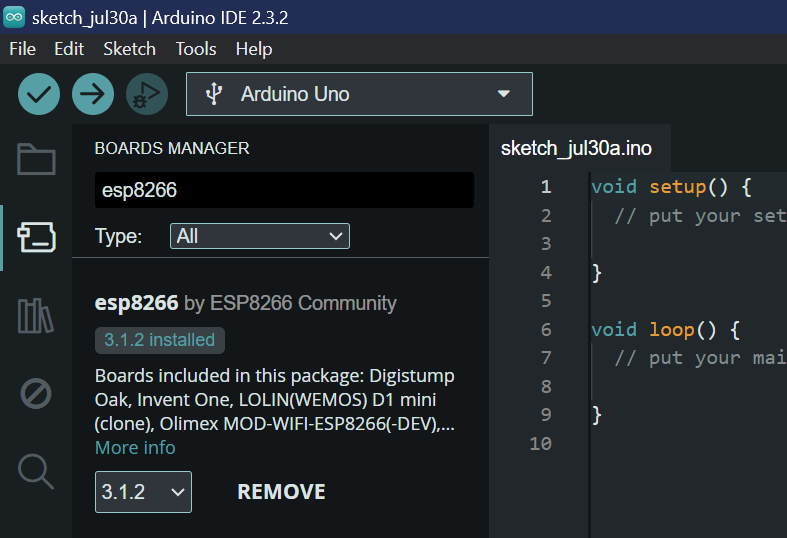

# IoT and 5G Workshop Repository

Welcome to the official repository for the IoT and 5G Workshop organized by Universiti Sains Islam Malaysia (USIM) and sponsored by IEEE. This repository contains all the necessary resources, including Arduino/ESP8266 code, Tinkercad project links, Node-RED flows, and other relevant materials.

## Table of Contents

- [Introduction](#introduction)
- [Workshop Details](#workshop-details)
- [Repository Structure](#repository-structure)
- [Getting Started](#getting-started)
- [Resources](#resources)
- [Contributing](#contributing)
- [License](#license)
- [Contact](#contact)

## Introduction

This repository is designed to support participants of the IoT and 5G Workshop. It includes all the coding examples, project links, and configurations needed to successfully complete the workshop exercises and projects. 

## Workshop Details

- **Organizer:** Universiti Sains Islam Malaysia (USIM)
- **Sponsor:** IEEE
- **Participants:** Students from Sekolah Menengah Agama Persekutuan (SMAP) Labu
- **Time:** 9:30 a.m. - 12:30 p.m.
- **Topics Covered:** 
  - Internet of Things (IoT)
  - 5G Technology
  - Tinkercad Simulations
  - Arduino/ESP8266 Programming
  - Node-RED Flows
 

## Repository Structure

The repository is organized into the following directories:

- **Arduino_ESP8266_Code:** Contains all the Arduino and ESP8266 source code files.
- **Tinkercad_Projects:** Links to Tinkercad projects used during the workshop.
- **NodeRED_Flows:** JSON files for Node-RED flows.
- **Documentation:** Any additional documentation or notes for the workshop.

## Getting Started

To get started with the workshop materials, follow these steps:

1. **Clone the Repository:**
   ```bash
   git clone https://github.com/ainul21/IEEE-STEM-Program.git
   cd IEEE-STEM-Program
   ```

2. **Arduino/ESP8266 Setup:**
   
   ### Prerequisites: Arduino IDE Installed
   
   Before starting this installation procedure, make sure you have the latest version of the Arduino IDE installed on your computer. If you don’t, uninstall it and install it again. Otherwise, it may not work.

   Having the latest Arduino IDE software installed from [arduino.cc](https://www.arduino.cc/en/Main/Software), continue with this tutorial.

   Do you need an ESP8266 board? You can buy it [here](https://www.vectoraintech.com).

   ### Install ESP8266 Add-on in Arduino IDE
   
   To install the ESP8266 board in your Arduino IDE, follow these next instructions:

   1. **Open Preferences:**
      In your Arduino IDE, go to `File > Preferences`.

   2. **Enter Board Manager URL:**
      Enter `http://arduino.esp8266.com/stable/package_esp8266com_index.json` into the “Additional Boards Manager URLs” field as shown in the figure below. Then, click the “OK” button:

      

      *Note: if you already have the ESP32 boards URL, you can separate the URLs with a comma as follows:*
      ```
      https://dl.espressif.com/dl/package_esp32_index.json, http://arduino.esp8266.com/stable/package_esp8266com_index.json
      ```

   3. **Open Boards Manager:**
      Go to `Tools > Board > Boards Manager…`

      

   4. **Install ESP8266 Board:**
      Search for `ESP8266` and press the install button for the “ESP8266 by ESP8266 Community”:

      

      That’s it. It should be installed after a few seconds.

      


3. **Tinkercad Projects:**
   - Access the Tinkercad projects using the links provided in the `Tinkercad_Projects` directory.

4. **Node-RED Flows:**
   - Installing Node-RED as a global module adds the command node-red to your system path. Execute the following at the command prompt:
     ```
      npm install -g --unsafe-perm node-red
      ```
   - Import the JSON files in the `NodeRED_Flows` directory into your Node-RED instance.

## Resources

Here are some additional resources to help you with the workshop:

- [Arduino Official Documentation](https://www.arduino.cc/en/Guide/HomePage)
- [ESP8266 Community Forum](https://www.esp8266.com/)
- [Node-RED Documentation](https://nodered.org/docs/)
- [Tinkercad Tutorials](https://www.tinkercad.com/learn)

## Contributing

We welcome contributions from all participants. If you have any improvements, bug fixes, or additional examples, please follow these steps:

1. Fork the repository.
2. Create a new branch (`git checkout -b feature-branch`).
3. Make your changes and commit them (`git commit -m 'Add some feature'`).
4. Push to the branch (`git push origin feature-branch`).
5. Create a pull request.

## License

This repository is licensed under the MIT License. See the [LICENSE](LICENSE) file for more details.

## Contact

For any questions or inquiries about the workshop, please contact:

- **Organizer:** [USIM](https://www.usim.edu.my/)
- **Sponsor:** [IEEE](https://www.ieee.org/)

You can also reach out to the workshop coordinators through the issues section of this repository.

---

Thank you for participating in the IoT and 5G Workshop. We hope you find these resources helpful and inspiring for your projects!
